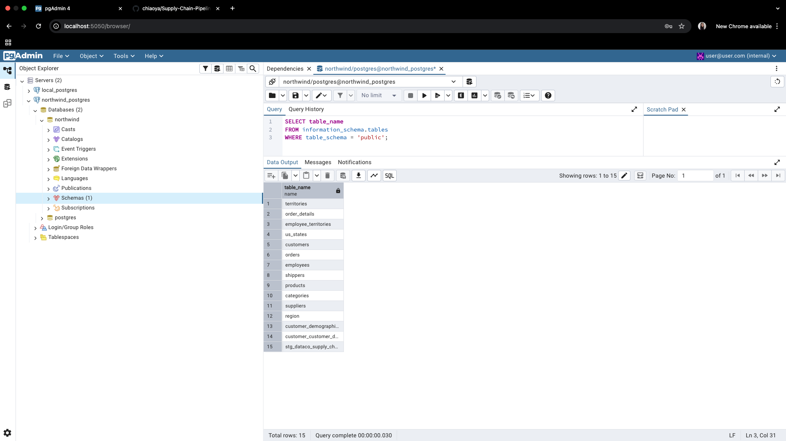

# Supply Chain Pipeline Engineering PySpark Starter

A starter project for practicing ML engineering with PySpark.
This repository demonstrates a workflow where Kaggle supply-chain data was first ingested into PostgreSQL for demo and practice purposes, then processed with PySpark for cleaning, transformation and dashboard-ready analytics.
The current project is PostgreSQL-first and focused on supply chain analytics with PySpark.
The main goal is to turn operational tables into reusable analytical datasets for demand analysis, fulfillment analysis, and KPI tracking.

## Demo Data Flow

1. Kaggle source CSVs are loaded into a local PostgreSQL database (as a first ingest step).
2. Data is read from Postgres via JDBC (`orders`, `order_details`, `products`, etc.) and exploratory checks are shown using SQL.
3. PySpark jobs clean and transform records (e.g. dedup, normalize dates, compute demand metrics).
4. Aggregated output is written into analytical output folders and displayed through notebook/dashboard visualizations.

## Screenshot (Postgres + PySpark + Dashboard)



The `image/` folder includes `db_screenshot.png` showing:
- PostgreSQL raw table view (ingested Kaggle data)
- PySpark pipeline status and cleaned output
- dashboard summary for demand and revenue insights


## Project Structure

```text
ml-engineering-pyspark/
├── README.md
├── requirements.txt
├── pyproject.toml
├── .gitignore
├── .vscode/
├── configs/
├── notebooks/
├── src/
│   └── ml_engineering_pyspark/
│       ├── jobs/
│       ├── transforms/
│       └── utils/
└── tests/
```

## Analysis Goals

This project is organized around three business questions:

1. Demand
   Measure how much of each product is ordered over time.

2. Fulfillment
   Measure whether shipments are delivered on time relative to customer expectations.

3. KPI Tracking
   Produce operational service metrics such as on-time rate, average delay, and late-order rate.

Core time fields:

- `order_date` is used to understand demand timing.
- `required_date` is used to evaluate service quality expectations.
- `shipped_date` is used to measure fulfillment execution.

## Supply Chain Tables

The PostgreSQL schema contains multiple supply chain tables. The most important ones for the current analysis are:

- `orders`
  Header-level order information. This is the main source for `order_date`, `required_date`, `shipped_date`, customer-level context, and shipment timing.

- `order_details`
  Line-level order records. This table provides `product_id`, `quantity`, `unit_price`, and `discount`, which are required for product demand and revenue analysis.

- `products`
  Product master data. This table provides product names and links products to categories and suppliers.

- `categories`
  Product category reference data. Useful for rolling product-level analysis up to category-level demand patterns.

- `customers`
  Customer master data. Useful for customer demand segmentation and service-level reporting by customer.

- `shippers`
  Shipper reference data. Useful for comparing fulfillment performance across logistics providers.

- `suppliers`
  Supplier reference data. Useful for upstream supply analysis and supplier-linked product reporting.

- `employees`
  Employee reference data. Useful when analyzing order ownership or regional operational performance.

Supporting tables currently listed in config include:

- `customer_customer_demo`
- `customer_demographics`
- `employee_territories`
- `region`
- `territories`
- `us_states`
- `stg_dataco_supply_chain`

These tables are not yet central to the MVP, but they can support deeper segmentation and geographic analysis later.

## Analytical Logic

### Step 1: Demand

Demand is based on order activity.

```text
groupBy(order_date, product_id)
sum(quantity)
```

This answers:

- Which products are being ordered most often?
- How does product demand change month over month?
- Which categories are gaining or losing demand?

In this context, `order_date` is the correct business date for demand because it reflects when the customer placed the order.

### Step 2: Fulfillment

Fulfillment is based on shipment delay versus the requested deadline.

```text
delay = shipped_date - required_date
```

This answers:

- Was the order shipped on time?
- How many days early or late was the shipment?
- Which products, customers, or shippers have worse service performance?

In this context, `required_date` is the key service-quality reference because it represents the promised delivery expectation.

### Step 3: KPI

From the fulfillment logic, the main service KPIs are:

- `on-time %`
- `avg delay`
- `late orders %`

Suggested KPI definitions:

- `on-time % = orders with delay <= 0 / total orders`
- `avg delay = average(shipped_date - required_date)`
- `late orders % = orders with delay > 0 / total orders`

## Quick Start

1. Create a virtual environment:

```bash
python3 -m venv .venv
source .venv/bin/activate
```

2. Install dependencies:

```bash
python -m pip install -r requirements.txt
```

3. Export your database password:

```bash
export DB_PASSWORD="<password>"
```

4. Test JDBC connectivity:

```bash
PYTHONPATH=src python -m ml_engineering_pyspark.jobs.test_jdbc_read \
  --jdbc-url "jdbc:postgresql://localhost:5433/supply_chain" \
  --jdbc-input-table "public.orders" \
  --db-user "postgres" \
  --jdbc-jar "/path/to/postgresql-42.7.10.jar"
```

5. Run the supply chain pipeline:

```bash
PYTHONPATH=src python -m ml_engineering_pyspark.jobs.supply_chain_pipeline \
  --jdbc-jar "/path/to/postgresql-42.7.10.jar"
```

6. Run the product demand MVP:

```bash
PYTHONPATH=src python -m ml_engineering_pyspark.jobs.product_demand_base \
  --jdbc-jar "/path/to/postgresql-42.7.10.jar"

PYTHONPATH=src python -m ml_engineering_pyspark.jobs.product_demand_summary \
  --jdbc-jar "/path/to/postgresql-42.7.10.jar"

PYTHONPATH=src python -m ml_engineering_pyspark.jobs.product_demand_monthly \
  --jdbc-jar "/path/to/postgresql-42.7.10.jar"
```

If you prefer not to set `PYTHONPATH`, install the package first:

```bash
python -m pip install -e .
```

7. Run tests:

```bash
pytest
```

## Current Pipelines

- `supply_chain_pipeline`
  A general supply chain revenue summary pipeline built from `orders`, `order_details`, and `products`.

- `product_demand_base`
  Builds an order-line-level analytical base table for product demand.

- `product_demand_summary`
  Aggregates product-level demand and revenue metrics.

- `product_demand_monthly`
  Aggregates monthly demand and revenue metrics for time-series analysis.

The default config lives in [base.yaml](/Users/chiaoya_chang/Documents/Playground/ml-engineering-pyspark/configs/base.yaml).

## Suggested Next Steps

- Add a dedicated fulfillment pipeline using `required_date` and `shipped_date`
- Add service KPI tables for on-time performance
- Add category-level and shipper-level reporting
- Add validation checks for schema and null thresholds
- Add GitHub Actions for CI
